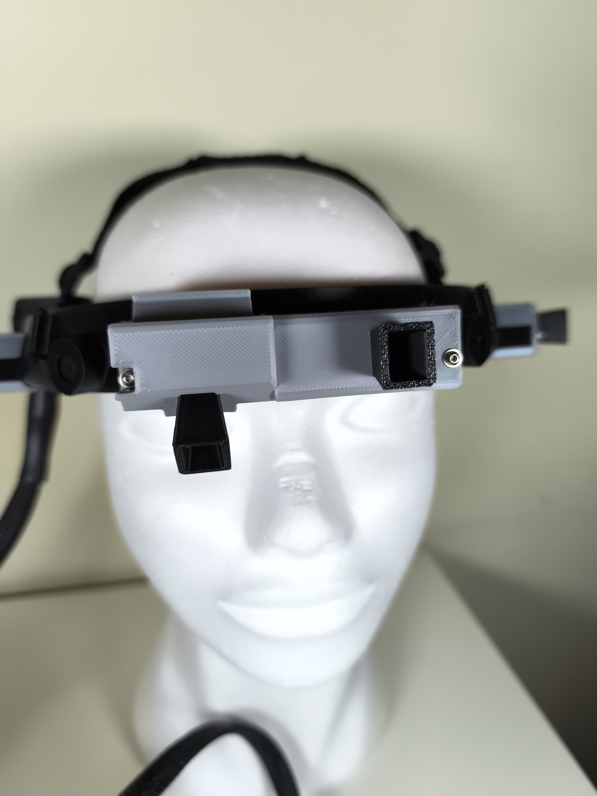
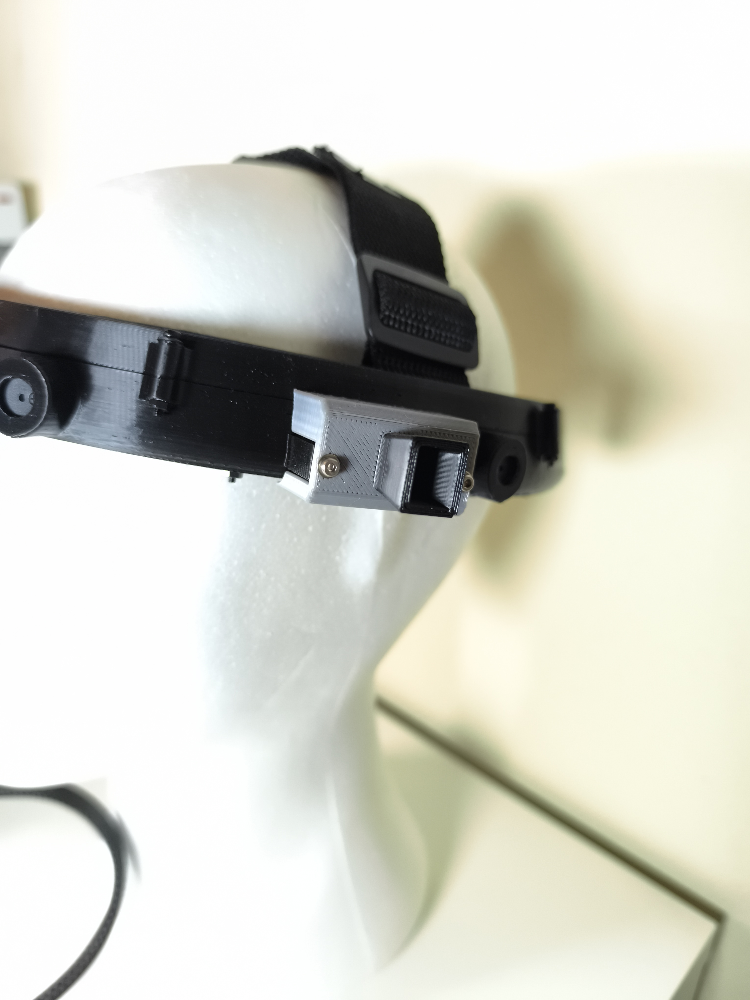

# 🦯 Cerchietto Smart con Sensori VL53L1X

**9 mesi di sviluppo. 4 sensori ToF. Funziona indoor. Fallisce outdoor.**

Questo repository documenta cosa ho imparato sui limiti reali dei sensori VL53L1X in ambiente esterno.

## 🎬 Il progetto in video

[→ Guarda il reel completo](https://www.instagram.com/reel/DTgGp6-iFGg/)

## ⚡ In sintesi

Ho progettato un cerchietto indossabile con 4 sensori di distanza laser (VL53L1X) per assistere persone non vedenti nel rilevamento di ostacoli.

**Risultato:**
- ✅ **Indoor**: funzionamento perfetto (0,2–1,2 m, feedback stabile)
- ❌ **Outdoor**: 80–95% delle misure invalide, anche con cielo coperto

**Causa:** il sensore VL53L1X usa laser a 940 nm. Il sole emette radiazione massiccia proprio a 940 nm, saturando il ricevitore. Nessun filtro ottico risolve il problema: è un limite fisico del componente.

## 🔧 Hardware utilizzato

- ESP32 WROOM-32
- 4× VL53L1X (breakout Adafruit)
- Multiplexer I²C TCA9548A
- 4 buzzer attivi 3V (feedback acustico)
- Cover ottiche certificate Gilisymo (specifiche per VL53L1X)

**Software:** libreria Pololu VL53L1X (maggiore controllo firmware rispetto ad Adafruit)

### Il prototipo

*Vista frontale del cerchietto con elettronica e sensori montati*

*Dettaglio dei 4 sensori VL53L1X con cover ottiche Gilisymo e schermature protettive*

*Vista dall'alto: disposizione dei sensori e architettura del sistema*

## 📸 Galleria fotografica completa

Clicca per vedere tutte le foto del prototipo

## 🧪 Cosa ho provato

1. **Filtri IR generici** → crosstalk eccessivo
2. **Cover ottiche certificate** → miglioramento indoor, insufficiente outdoor
3. **Schermature meccaniche** → riduzione parziale del rumore, problema persiste
4. **Filtri software** (debounce, media mobile) → non risolvono l'assenza di dati validi

## 📊 Dati reali

Percentuale di misure invalide in diverse condizioni:

| Condizione | Misure valide | Range affidabile |
|-----------|---------------|------------------|
| Indoor | >95% | 1,3 m |
| Cielo coperto | 10–20% | 0,8 m |
| Sole diretto | <5% | 0,3 m |

Con <20% di misure valide, il feedback acustico diventa irregolare e non affidabile.

## 💡 Conclusione per maker

Se devi rilevare ostacoli **outdoor**, il VL53L1X non è la scelta giusta.

**Alternative consigliate:**
- **Ultrasuoni** (JSN-SR04T): economico, waterproof, range 4,5m
- **ToF industriale** (Benewake TFmini-S Plus): laser progettato per esterno, range 12m
- **Radar mmWave 60 GHz**: insensibile a luce, pioggia, nebbia

## 📄 Documentazione tecnica completa

Vuoi tutti i dettagli su SNR, configurazioni firmware, analisi delle alternative?

→ [Relazione tecnica completa (ITA)](docs/vl53l1x_outdoor_analysis.md)  
→ [Full technical analysis (ENG)](docs/vl53l1x_outdoor_analysis_en.md) *(coming soon)*

## 📜 Licenza

MIT License - usa, modifica, condividi liberamente.

